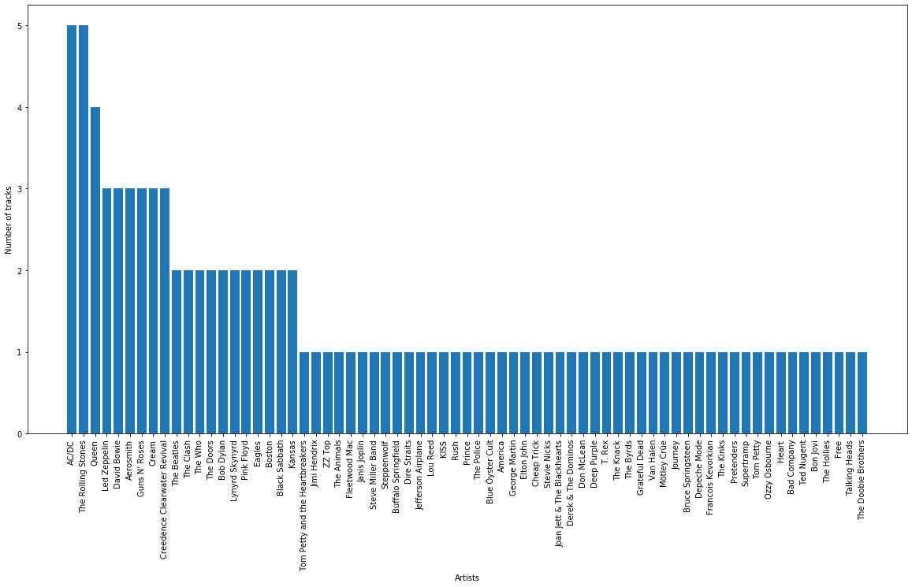
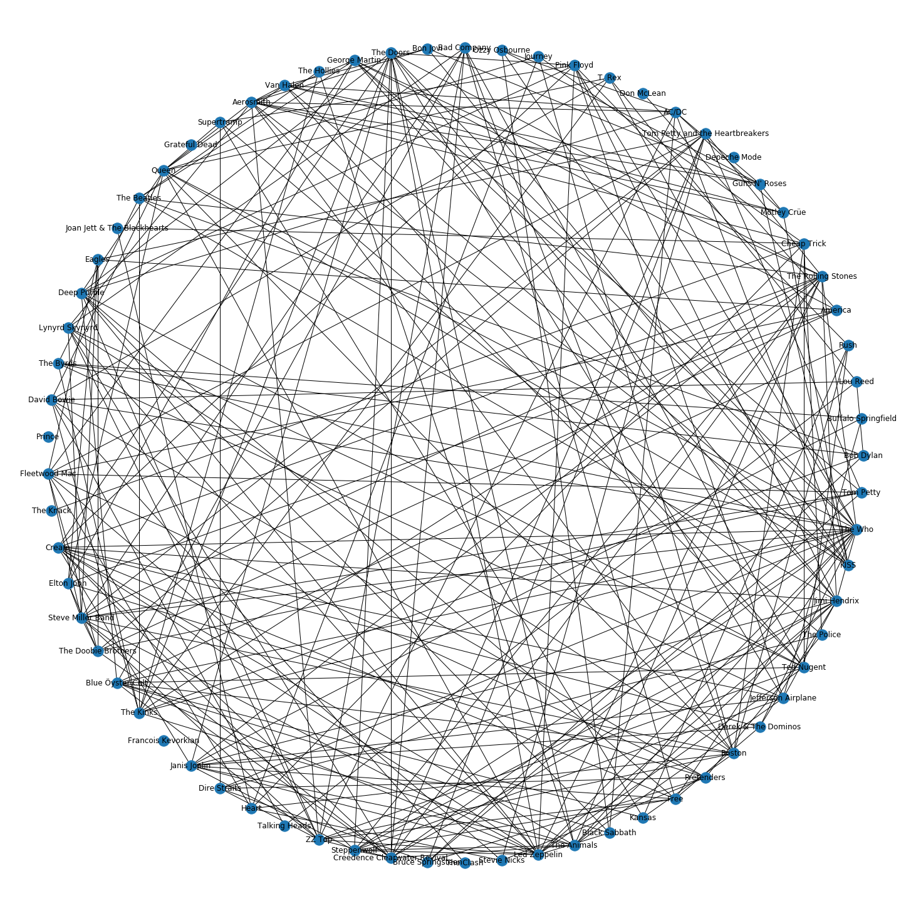
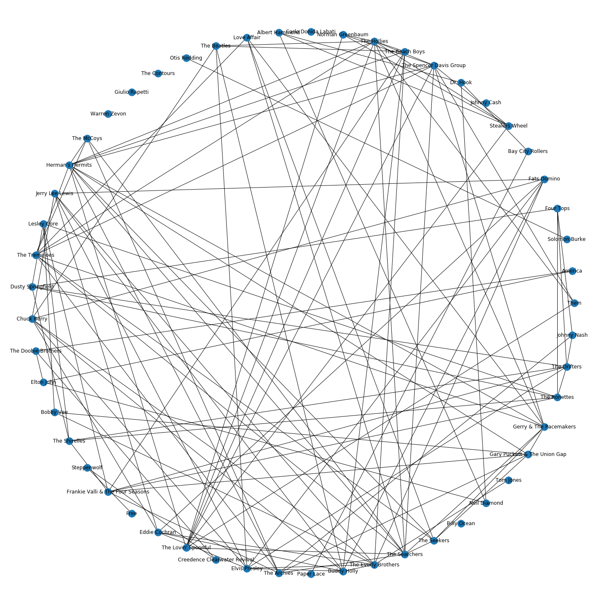
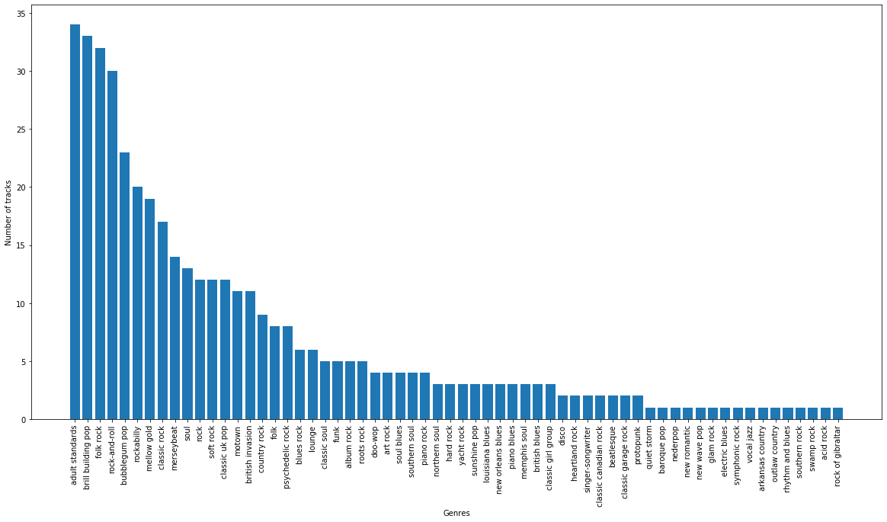
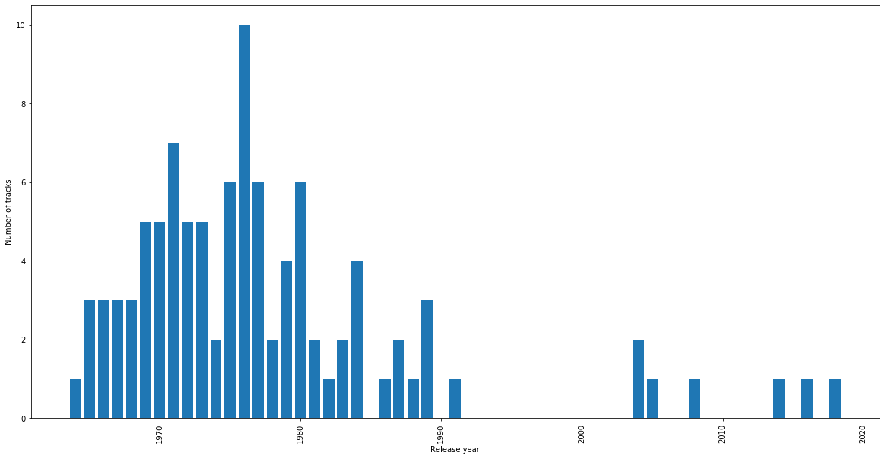
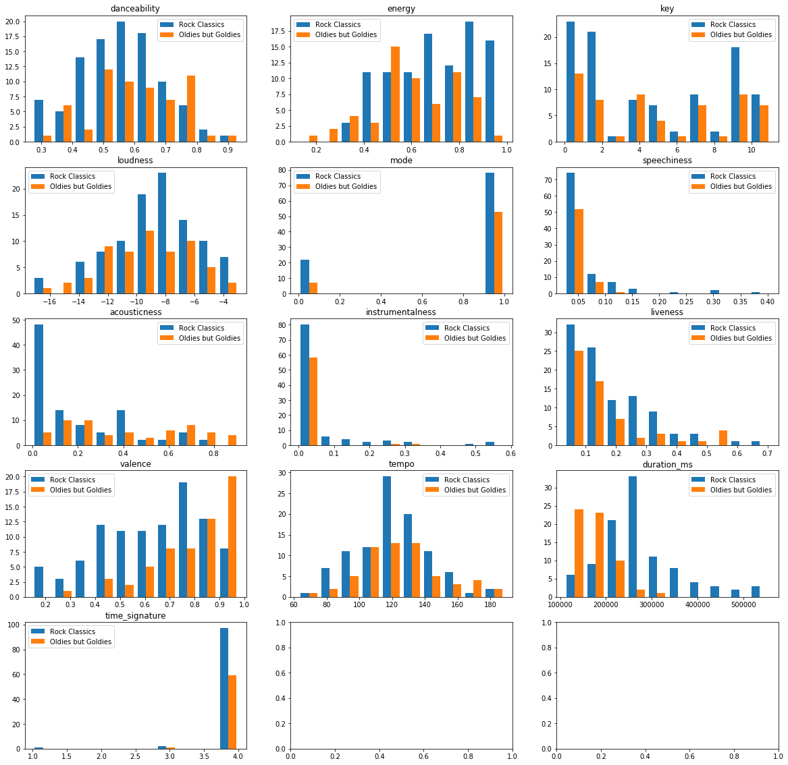

# Project of Data Visualization (COM-480)

| Student's name | SCIPER |
| -------------- | ------ |
| Pierre Schutz | 272648 |
| Nathan Kammoun | 282625 |
| David Cian | 287967 |

[Milestone 1](#milestone-1) • [Milestone 2](#milestone-2) • [Milestone 3](#milestone-3)

[Website](https://playlist-alchemy.herokuapp.com/);

## Milestone 1 (23rd April, 5pm)

### Dataset

The dataset we will explore in this project is the Spotify dataset which contains songs, users, artists, and playlist data from the Spotify audio streaming platform. The dataset is hosted by Spotify and imported through the Spotify Web API [1].

According to Wikipedia, “Spotify offers digital copyright restricted recorded music and podcasts, including more than 70 million songs, from record labels and media companies. As a freemium service, basic features are free with advertisements and limited control, while additional features, such as offline listening and commercial-free listening, are offered via paid subscriptions. Users can search for music based on artist, album, or genre, and can create, edit, and share playlists.”

The data coming from Spotify Web API is of good quality as Spotify is a company that highly relies on data. The API provides clean data and there will be no need for pre-processing nor cleaning. There is a ready-to-use Spotify Dataset available on Kaggle pre-imported from the Spotify API but we chose to make real-time queries to the API to build our visualizations. By doing so, we will be able to fetch user playlists data using Spotify Login widgets.

The Spotify API provides a wide range of queries, we will therefore specify here the endpoints and objects that we will be using through this project. See Spotify API Reference [2].

#### Get Playlists

The playlist data will be fetched using the following endpoints :

**Endpoints:**
- [Get Featured Playlists](https://developer.spotify.com/documentation/web-api/reference/#endpoint-get-featured-playlists)
- [Get a Category's playlists](https://developer.spotify.com/documentation/web-api/reference/#endpoint-get-a-categories-playlists)
- [Get current user's playlists](https://developer.spotify.com/documentation/web-api/reference/#endpoint-get-a-list-of-current-users-playlists)

**Object:**
- [PlaylistObject](https://developer.spotify.com/documentation/web-api/reference/#object-playlistobject)

These endpoints enable us to fetch the features playlists, playlists by category, and user's playlists.
We aim to use those to enable the user to select multiple playlists he wants to analyze and compare (user login will be optional).

#### Tracks and Artists

The playlists are a list of selected tracks, we can get details information about the 
tracks and their authors using the tracks and artist's endpoints described below.

**Endpoints:**
- [Get an artist](https://developer.spotify.com/documentation/web-api/reference/#endpoint-get-an-artist)
- [Get an artist's related artists](https://developer.spotify.com/documentation/web-api/reference/#endpoint-get-an-artists-related-artists)
- [Get a track](https://developer.spotify.com/documentation/web-api/reference/#endpoint-get-track)

**Objects:**
- [ArtistObject](https://developer.spotify.com/documentation/web-api/reference/#object-artistobject)
- [TrackObject](https://developer.spotify.com/documentation/web-api/reference/#object-trackobject)

These endpoints enable us to get detailed information about the playlists' tracks and artists. 
The related artist's endpoint will help us understand similarities between artists. 

#### Track's audio features

Finally, we most interesting feature of this Spotify API, the audio features. 
Spotify API provides a list of track features that we will use to analyze the tracks such as
'acousticness', 'danceability', or 'speechiness' (see AudioFeaturesObject for a detailed description).

**Endpoint:**
- [Get Audio Features](https://developer.spotify.com/documentation/web-api/reference/#endpoint-get-audio-features)

**Object:**
- [AudioFeaturesObject](https://developer.spotify.com/documentation/web-api/reference/#object-audiofeaturesobject)


[1] Spotify Web API: https://developer.spotify.com/documentation/web-api/
[2] Spotify API Reference: https://developer.spotify.com/documentation/web-api/reference/#reference-index


The dataset we will explore in this project is the Spotify dataset which contains songs, users, artists, 
and playlist data from the Spotify audio streaming platform. The dataset is hosted by Spotify and queried through the Spotify Web API [1]. 

According to Wikipedia, “Spotify offers digital copyright restricted recorded music and podcasts, 
including more than 70 million songs, from record labels and media companies.
As a freemium service, basic features are free with advertisements and limited control, 
while additional features, such as offline listening and commercial-free listening, 
are offered via paid subscriptions. Users can search for music based on artist, album, 
or genre, and can create, edit, and share playlists.” 

The data coming from Spotify Web API is of good quality as Spotify is a company that highly relies on data. The API provides clean data and there will be no need for pre-processing nor cleaning. There is a ready to use Spotify Dataset available on Kaggle built from Spotify data but we will be directly making real-time queries to the API to build our visualizations. By doing so, we will be able to fetch user playlists data using Spotify Login widgets. 

The Spotify API provides a wide range of queries, we will therefore specify here the endpoints and objects that we will be using through this project. 
See Spotify API Reference [2].

#### Get Playlists

The playlist data will be fetched using the following endpoints : 

**Endpoints:**
- [Get Featured Playlists](https://developer.spotify.com/documentation/web-api/reference/#endpoint-get-featured-playlists)
- [Get a Category's playlists](https://developer.spotify.com/documentation/web-api/reference/#endpoint-get-a-categories-playlists)
- [Get current user's playlists](https://developer.spotify.com/documentation/web-api/reference/#endpoint-get-a-list-of-current-users-playlists)

**Object:**
- [PlaylistObject](https://developer.spotify.com/documentation/web-api/reference/#object-playlistobject)

These endpoints enable us to fetch the features playlists, playlists by category, and user's playlists.
We aim to use those to enable the user to select multiple playlists he wants to analyze and compare (user login will be optional).

#### Tracks and Artists

The playlists are a list of selected tracks, we can get details information about the 
tracks and their authors using the tracks and artist's endpoints described below.

**Endpoints:**
- [Get an artist](https://developer.spotify.com/documentation/web-api/reference/#endpoint-get-an-artist)
- [Get an artist's related artists](https://developer.spotify.com/documentation/web-api/reference/#endpoint-get-an-artists-related-artists)
- [Get a track](https://developer.spotify.com/documentation/web-api/reference/#endpoint-get-track)

**Objects:**
- [ArtistObject](https://developer.spotify.com/documentation/web-api/reference/#object-artistobject)
- [TrackObject](https://developer.spotify.com/documentation/web-api/reference/#object-trackobject)

These endpoints enable us to get detailed information about the playlists tracks and artists. 
The related artist endpoint will help us understand similarities between artists. 

#### Track's audio features

Finally, the feature we will be using the most is the audio features query. 
Spotify API provides a list of track features that we will use to analyze the tracks such as
'acousticness', 'danceability', or 'speechiness' (see AudioFeaturesObject for a detailed description).

**Endpoint:**
- [Get Audio Features](https://developer.spotify.com/documentation/web-api/reference/#endpoint-get-audio-features)

**Object:**
- [AudioFeaturesObject](https://developer.spotify.com/documentation/web-api/reference/#object-audiofeaturesobject)


[1] Spotify Web API: https://developer.spotify.com/documentation/web-api/
[2] Spotify API Reference: https://developer.spotify.com/documentation/web-api/reference/#reference-index


### Problematic

There are many ways one can listen to music. You can search for a specific track or listen to an album, but one of the most popular ways of doing so is by listening to a playlist, the digital descendant of the mixtape. In fact, playlists are central to the Spotify experience, as all playlists created by Spotify users start out public and can be composed collaboratively. Even Spotify itself has been lauded for its recommendation engine, which can on top of recommending individual songs generate playlists for users.

Beneath the surface, playlists are a stranger beast than one might expect. It is quite common for a user-made playlist to include tracks from different albums, different artists, even different genres! Furthermore, playlists represent a window into users' most minute idiosyncrasies. For this reason, playlists represent a perfect pocket of complexity to be explored visually. The goal of our visualizations is to allow Spotify users to gain insight into the patterns hiding in their playlists.

Thus, the user becomes a biologist exploring the anatomical details of their playlists, in all of their beautiful diversity. The tracks in my workout playlist come from many artists, but what if their danceability or their upbeat nature is what they have in common? What about my commute playlist, what do those songs have in common? How do a playlist's characteristics change along its track order, does order matter or can one listen on shuffle? How does a playlist evolve over time? One could argue that every single playlist is bound together by some common factor hidden deep inside a user's preferences, perhaps the goal of eliciting a certain cocktail of feelings.

Our hope is that our visualization allow users to find that common factor.

### Exploratory Data Analysis

> Pre-processing of the data set you chose
> - Show some basic statistics and get insights about the data

As discussed above, we do not need to pre-process the dataset. 
Through this data exploration, we wanted to show that playlists can indeed be compared in terms of audio features.
It enabled us to confirm that we will later be able to establish meaningful playlist analysis and comparisons. 
The detailed exploration can be found in the [milestone1_eda.ipynb](/milestone1_eda.ipynb) jupyter notebook. 

Here is a non-exhaustive list of questions we asked ourselves about our question. 
- What makes a playlist original?
- How diverse is the playlist in terms of artists, genre?
- How diverse is a playlist regarding the audio features (such as acousticness, danceability)?
- How the different parameters (artists, genre, audio features) help us compare playlists? 

In the exploration, we first analyze one playlist 
and observe its different parameters, and then compare it with another playlist.

The playlists used for this exploration are 'Rock Classics' and 'Oldies but Goldies'. After comparing the audio features, we observed:

- 'Oldies but Goldies' has significantly higher valance than 'Rock Classics'
- 'Rock Classics' songs duration are much longer (duration_ms) than 'Oldies but Goldies'
- 'Rock Classics' tends to have more energy than 'Oldies but Goldies'
- 'Oldies but Goldies' have higher danceability than 'Rock Classics'

We present here some of the plots that we got from observing the two playlists: 

#### Figure 1. Number of track per artist (Rock Classics)


#### Figure 2. Artists relations graph  (Rock Classics)


#### Figure 3. Artists relations graph (Oldies but Goldies)


#### Figure 4. Number of track per genre (Oldies but Goldies)


#### Figure 5. Number of track per release year (Rock Classics)


#### Figure 6. Audio features distribution (Rock Classics and Oldies but Goldies)


The detailed exploration can be found in the [milestone1_eda.ipynb](/milestone1_eda.ipynb) jupyter notebook. 

**Python notebooks:**
- Detailed playlists exploration: [milestone1_eda.ipynb](milestone1_eda.ipynb)
- Broader dataset exploration: [data_exploration](data_exploration.ipynb)


### Related work

The Spotify API is very popular. Spotify has a well documented API and provides a lot useful tools on a dedicated ‘Spotify for Developers’ website. Spotify showcases a broad panel of the work done through their API. It was a great source of inspiration as well as a big challenge in order to propose something original. A non exhaustive list of interesting projects and visualization with Spotify data can be found here : https://developer.spotify.com/community/showcase/. 

It is difficult to bring something new to all that has already been done but we believe that taking a playlist oriented approach is both meaningful and original. Our visualization will take place on a website which brings a dimension of interaction. Our approach will privilege interactive visualizations, it will focus on visually revealing playlists features, possible links between playlists or what makes them different.  The user will be able to navigate by himself through the data to visualize what he wants.

Here is a list of related works and sources of inspiration we found:
- [Spotify user profile analysis](https://obscurifymusic.com/)
- [Spotify user's top tracks and genres visualisation](https://lsouth.github.io/spotify-visualization)
- [Interactive historical map of music](https://musicmap.info/)


## Milestone 2

See [Milestone2 pdf report](./Report%20Milestone%202.pdf)

## Milestone 3

### Screencast

See a short video presentation of our website: [Video](https://drive.google.com/file/d/1p02Z8-GTz5eh-a4xNrl0D_uLrb55xE08/view?usp=sharing)

### Process book 

Report of the project, with details about the data and visualization: [Process Book](./non_website_docs/DV_Process_Book.pdf)

### Website

- [https://playlist-alchemy.herokuapp.com/](https://playlist-alchemy.herokuapp.com/)


Steps to run the website locally

1. Clone git repository

```shell script
git clone https://github.com/com-480-data-visualization/data-visualization-project-2021-kcs.git
```

2. Add '.env' file with Spotify API paramters:
```shell script
HOST=localhost
PORT=8000
SPOTIFY_CLIENT_ID=XXX
SPOTIFY_SECRET=XXX
```

2. Go the the website root directory
```shell script
cd ./data-visualization-project-2021-kcs/
```

3. Install required packages
```shell script
npm install
```

4. Run the server locally
```shell script
npm start
```


